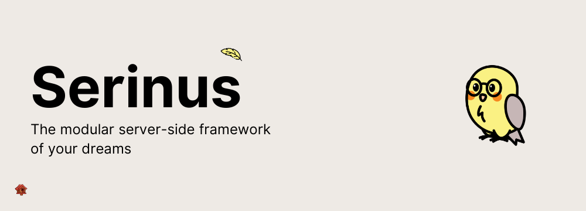

  

<h2 align="center">
	Awesome Serinus 
	
</h2>

	A curated list of awesome things related to 
	<a href='https://github.com/francescovallone/serinus'>Serinus</a>

 

## Introduction

Serinus is the opinionated Dart backend framework, built on top of the Dart ecosystem. It provides a set of tools and libraries to help you build scalable and maintainable backend applications with ease.

## Table of Contents

- [General](#general)
- [Articles](#articles)
- [Plugins](#plugins)

## General

- [Website](https://serinus.app) - The official website of Serinus, where you can find documentation, guides, and other resources to get started with the framework.
- [GitHub Repository](https://github.com/francescovallone/serinus) - The official GitHub repository of Serinus, where you can find the source code, report issues, and contribute to the project.

## Articles

- [Dart Frog vs Serinus: A Comparison](https://medium.com/@francescovll/dart-frog-vs-serinus-a-comparison-6991d9c99526)

## Plugins

- [serinus_openapi](https://github.com/francescovallone/serinus/tree/main/packages/serinus_openapi)(official) - Plugin to generate OpenAPI documentation for your Serinus application.
- [serinus_schedule](https://github.com/francescovallone/serinus/tree/main/packages/serinus_schedule)(official) - Plugin to schedule tasks in your Serinus application.
- [serinus_serve_static](https://github.com/francescovallone/serinus/tree/main/packages/serinus_serve_static)(official) - Plugin to serve static files in your Serinus application.
- [serinus_frontier](https://github.com/francescovallone/serinus/tree/main/packages/serinus_frontier)(official) - Plugin to create a Passport-like authentication system in your Serinus application.
- [serinus_loxia](https://github.com/avesbox/serinus_loxia)(official) - Plugin to integrate Loxia, a powerful ORM for Dart, into your Serinus application.
- [serinus_config](https://github.com/francescovallone/serinus/tree/main/packages/serinus_config)(official) - Plugin to manage configuration in your Serinus application.
- [serinus_microservices](https://github.com/francescovallone/serinus/tree/main/packages/serinus_microservices)(official) - Plugin to build microservices with Serinus.
- [serinus_test](https://github.com/francescovallone/serinus/tree/main/packages/serinus_test)(official) - Plugin to test your Serinus application.
